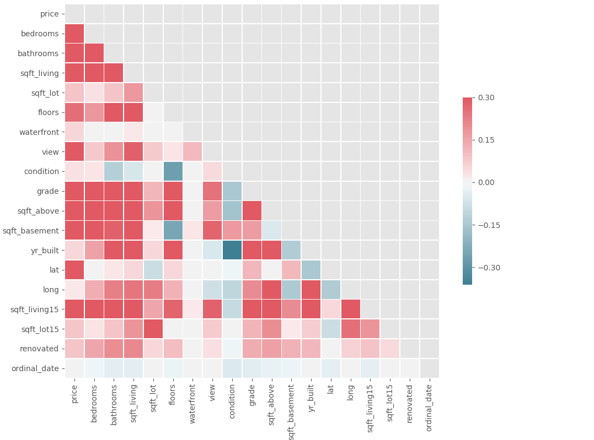

# Predicting Home Prices in King County

## The Scenario
For this project, I was primarily thinking about a company that buys and remodels homes for the purpose of reselling at a higher price.  The goal is to not only figure out how best to improve the price of a home, but how to identify which homes are likely to provide the best return on investment.

- **Primary Stakeholder:** A company that buys houses in King County with the intent of remodeling / renovating and reselling at higher prices.

- **Problem Statement:** Given King County home sales data in the last year, identify the most important factors that impact price, and make recommendations on how the firm can maximize its profits.

## Methodology
We are going to first look at the various factors that might be good predictors of home price, determine which ones are relevant and which ones aren’t, then look at the nature of those relationships. We will finish up by looking at some specific recommendations.

## Scope
With the data available, I determined that the potential predictors of sale price can be generally grouped into 4 categories: 
 
- **Size**: Includes total square footage, number of bedrooms and bathrooms, number of floors, lot size, etc.
- **Condition**: Includes condition rating, year built, and a grade assigned by King County.
- **Location**: Based on gps coordinates, zip code, and whether it has a waterfront view
- **Market Conditions**: Look at the date sold and determine if there are any inflationary or cyclical trends that would significantly impact the selling price of a home

## Relevant Factors
By looking at the collinearity heatmap below, we can see which factors have the strongest correlation with price, and which factors have the strongest correlation with each other.

### Insignificant Factors
Trends in market fluctuations were all but non-existent, and buyers appear to be surprisingly unwilling to pay a premium for higher quality. Now, there is a caveat here in that the grade does serve as a strong predictor of price, but unless you know how that grade is calculated, the information is not likely to be useful. Hence, it was not considered relevant for this analysis.

Location was the strongest predictor of price, with certain zip codes providing better opportunities for profit increases. However, waterfront property itself did not seem to matter much either.

### Most Significant Factors
#### Square Footage (Home & Lot Size)
It should be no surprise that as size increases, so does price. For every percentage increase in square footage, the sale price can be expected to increase by a little more than a half a percent. To put this into perspective, if someone purchased a \\$500k, 800 square foot home, and you increased the square footage by 25\%, it would be expected to sell for approximately \\$60k - \\$85k more. However, it is important to remember that how you build matters as well.

As we can see in the graph on the right, buyers pay a premium for larger lot sizes. So if you simply build outward, you may end up seeing diminishing returns for your efforts. 

#### Bedrooms & Floors
As house size increases, it is normal to expect that number of bedrooms increases. So, it would seem that more bedrooms lead to higher prices. However, does this mean that you can take a home, knock down and rearrange some walls to add an extra bedroom, then turn around and sell it for more? Sadly, the answer is no. As can be seen here, when the bedroom count to square footage ratio increases, price decreases. This tells us that buyers prefer more space, not more rooms. 

A similar, albeit weaker relationship with the number of floors relative to square footage also exists: people don’t like walking up stairs. It should be noted that lot size plays a stronger role than number of floors, suggesting that it would be better to build upwards rather than outwards.

#### Location
You’ll see we have plotted all home sales on a zip code map based on their gps coordinates (data was exported to csv and the graphic was created using Tableau). 

Darker shades of red indicate higher selling price. The section in the circle is where you will find the highest prices. This is important to be aware of because a 10\% - 15\% premium will get you more absolute profit on a \\$1m home than a \\$500k home. Of course, it is unrealistic to expect that there are enough opportunities to buy in just this area, but if you focus in the north-west quadrant of the map, you can see that you will generally find more lucrative opportunities.

## Prediction Results
After applying log normalization and z-score standardization, a multilinear regression model was build with 10-fold cross-validation. Ultimately, we were able to achive a predicted r-squared score of 82.77\% (+/-1.4\%).

## Recommendations
Based on all of this information, I can make a few recommendations. 
- First, whether you are building a new home or remodeling and existing one: location, location, location.  Look for houses with large lots in the north-western section of the county.

- The ideal home for remodel will be 1.5 floors without a basement. By expanding the top floor, square footage can be increased by ~33\% without having to add stairs. This is the best opportunity to maximize ROI.

- Don’t spend too much effort upgrading, and don’t add bedrooms. Turning additional square footage into an open space or loft will be cheaper, and will be more appealing to potential homebuyers.

## Next Steps
Already, we have a lot of good information to increase profitability, but there is still more that can be done to help refine the strategy.
1. First, we can identify homes sold at least twice in the year, checking for changes in size, condition, and price. Such an analysis can potentially provide validation of our results, or uncover new opportunities and potential pitfalls. Even if it only serves to reinforce the findings here, it’s good to have that much more confidence. 

2. Another option would be to perform a cluster analysis on prices relative to location. This would allow for an improved ability to select locations. 

3. Finally, we can perform the entire analysis with a different target variable: price per square foot. Areas with the highest price per square foot are likely to result in higher returns on investment, even when optimal conditions may not present.